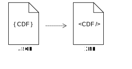

# CDFConverter

<!-- TOC -->

- [CDFConverter](#cdfconverter)
    - [Instructions](#instructions)
    - [Limitations](#limitations)

<!-- /TOC -->

This tool provides an web-based example of how the developed [XML and JSON conversion transformations](https://github.com/HiltonRoscoe/CDFPrototype/blob/master/conversion/format_conversion.md) can be used.

## Instructions

1. Open the [tool](https://hiltonroscoe.github.io/CDFConverter)
2. Select the Common Data Format you wish to work with from the *Input CDF* dropdown.
3. Paste the JSON CDF instance into the *CDF Input* text area.
4. Click the *Transform* button. XML output will appear in the *CDF Output* text area. Monitor the messages section for progress or errors.

## Limitations

- This tool runs completely in the browser. Because of this, supported file sizes and speed is dependant on your local computer's configuration.
- The program is not designed for the transformation of large files, please use a standalone tool.
- The tool currently only supports XML-to-JSON conversions. Please see [here] for information on performing XML-to-JSON conversions.
